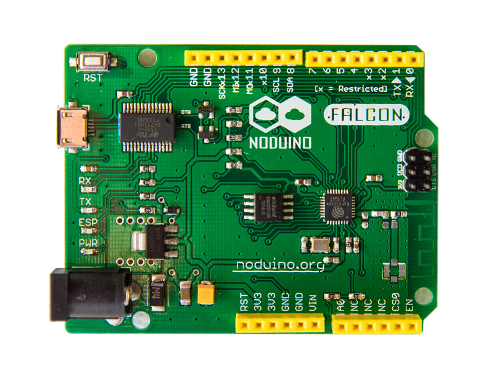

Noduino Falcon Board
=======================================

[*Noduino Falcon Board - Complete Falcon board (FALCON-009)*](https://www.noduino.org/)

Repository Contents
-------------------
* V1.2/ - All Eagle design files (.brd, .sch) of Falcon version 1.4 (FT232RL USB2UART chip)
* V2.1/ - All Eagle desgin files (.brd, .sch) of Falcon Version 2.1 (CP2102 USB2UART chip)

Product Versions
----------------
* [FALCON-007](http://www.noduino.org/) - Bare pcb.
* [FALCON-008](http://www.noduino.org/) - Geek Kit. Bare pcb plus chips, stackable headers, indicator LEDs, push buttons and resistors ...
* [FALCON-009](http://www.noduino.org/) - Complete Falcon board.

License Information
-------------------
The hardware is released under [Creative Commons ShareAlike 4.0 International](https://creativecommons.org/licenses/by-sa/4.0/).

Distributed as-is; no warranty is given.
