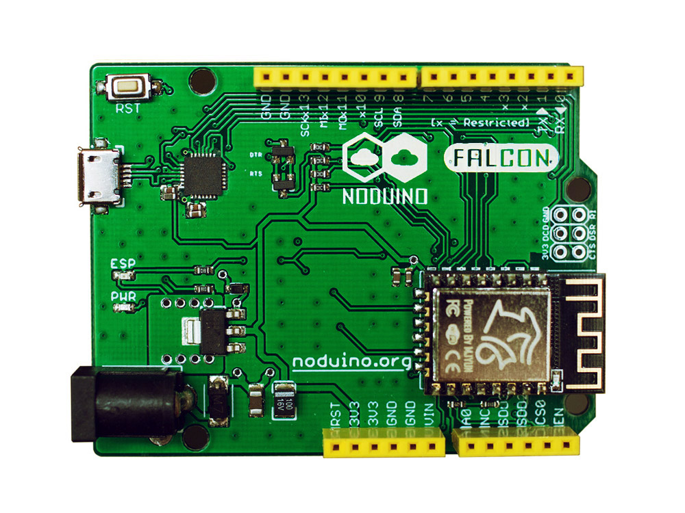

Noduino Falcon Board
=======================================

[*Noduino Falcon Board - Complete Falcon board (FALCON V1.2)*](https://www.noduino.org/)

[*Noduino Falcon Board - Complete Falcon board (FALCON V2.4)*](https://www.noduino.org/)

Overview
-------------------
Noduino Falcon is an ESP8266 Quick Development board.

The pin map of all versions of Falcon Board:

* D0	GPIO3 (U0RX) / URX during flash programming
* D1	GPIO1 (U0TX) / SPI CS1
* D2	GPIO2 (U1TX) / UTX during flash programming
* D3	GPIO15 (HSPI CS)
* D4	GPIO13 (HSPI MOSI)
* D5	GPIO12 (HSPI MISO)
* D6	GPIO14 (HSPI CLK)
* D7	GPIO16

* D8	GPIO4 
* D9	GPIO5
* D10	GPIO0  (SPI CS2)
* D11	GPIO8 (SD D1 / SPI MOSI)
* D12	GPIO7 (SD D0 / SPI MISO)
* D13	GPIO6 (SD CLK / SPI CLK)

* A0	TOUT  Analog In

Repository Contents
-------------------
* V1.2/ - All Eagle design files (.brd, .sch) and Gerber files of Falcon version 1.4 (FT232RL USB to UART chip)
* V2.1/ - All Eagle desgin files (.brd, .sch) and Gerber files of Falcon version 2.1 (CP2102 USB to UART chip, 0402 cap and resistor)
* V2.2/ - All Eagle desgin files (.brd, .sch) and Gerber files of Falcon version 2.2 (CP2102 USB to UART chip, 0603 cap and resistor)
* V2.4/ - All Eagle desgin files (.brd, .sch) and Gerber files of Falcon version 2.4 (CP2102 USB to UART chip, WiFi module)

Product Versions
----------------
* [FALCON-100](http://www.noduino.org/) - FT232RL USB to UART chip.
* [FALCON-200](http://www.noduino.org/) - CP2102 USB to UART chip.
* [FALCON-300](http://www.noduino.org/) - CP2102 USB2UART chip, WiFi Module.

License Information
-------------------
The hardware is released under [Creative Commons ShareAlike 4.0 International](https://creativecommons.org/licenses/by-sa/4.0/).

Distributed as-is; no warranty is given.
